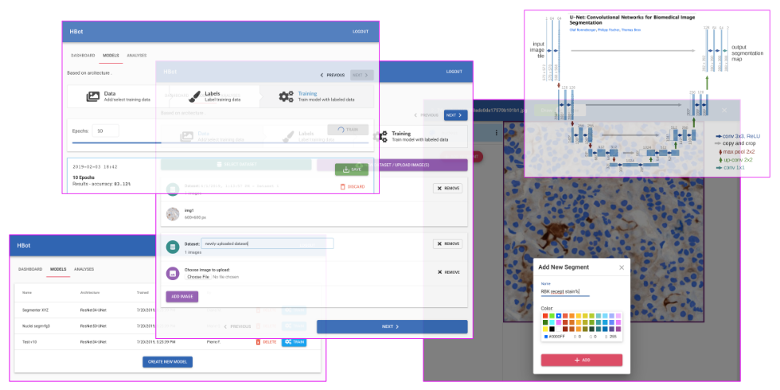

# Histo-Bot

> **STATUS:** UI not finished (*technically* usable through API), proof-of-concept version soon to be launched...

Histo-Bot enables bio-medical researchers to use state-of-the art deep-learning techniques for analyzing microscopy images, with no need for the users of this software to have any significant machine-learnig or deep learning experience.

The software is intended to:
- not require the users to have any advanced machine learning or deep-learning knowledge and/or experience - *if you can take 30 min to learn the basic machine learning concepts of training / testing / inference ("inference" may sometimes be called "analysis" for this application), you should be ready to start using Histo-Bot!*
- allow the user to (re)train deep neural network based models on their own sets of data, using a nice friendly UI for data labeling and training - *this is called "transfer learning" but as a user of Histo-Bot you shouldn't even need to know what it means :)*
- enable users to run analysis with their own custom models - for now the supported analysis types are:
  - segmenting images into different regions, eg. "nucleus", "stain A", "stain B", "RBC" etc. (think of it as applying a label to every pixel of an image), using custom models trained on user provided segmented image examples
  - counting the distinct regions marked with different labels (using simple parameters about the expected shape of valid regions)

The longer term goal is to develop this into a platform for complex analysis of microscopy images, capable to answer complex questions like "how many cells with oval shaped nuclei staining positive for Y but negative for Z are in this slide" and to be "smart" enough to recognize and eliminate slide preparation artifacts and to correctly draw cell contours and characterize their shapes automatically. We believe that modern deep-learning technology is powerful enough to solve such problems, it just need to be properly applied to the domain of histology and integrated with user-friendly UIs that will enable researchers to train and share their own custom models.

Histo-Bot's main functionality will **run on a server/cloud environment** appropriately provisoned to allow (re)training models in minutes, allowing rapid feedback and experimentation. Users will interact with it through a **web UI**.

This type of architecture will make it easier to, in the future:
- bill users for the actual computational resources they will use, instead of requiring them to pay for a software license (and of course, researchers will also be able to run it on their own servers for free, since it's fully open-source software)
- enable researchers to share and collaborate on custom models, and maybe even sell their models on a models-store (selling either the trained model paramters, or access to run analyses with the custom model)

## Technical notes

This is not even a v0.5 MVP, it's just a PoC ("proof of concept") version on which feedback is intended to be received as soon as possible.

Technologies used (final version might totally change these tech choices):
- the [fastai](https://docs.fast.ai/) library (based on [PyTorch](https://pytorch.org/))
- a basic [Django](https://www.djangoproject.com/) + [DRF](https://www.django-rest-framework.org/) backend app exposing a simple REST API
- a web UI frontend using [React.js](https://reactjs.org/)

## TODO:
In no particular order:
- finish UI <=> Backend integration
- gather feedback on features absolutely required for PoC and implement them fast
- write basic user docs + narrated video walk-through
- Dockerize environment for sane dev and deploy workflows
- document running and deployment
- expand testing and configure basic CI
- review basic security
- ...
- ...
- ...
