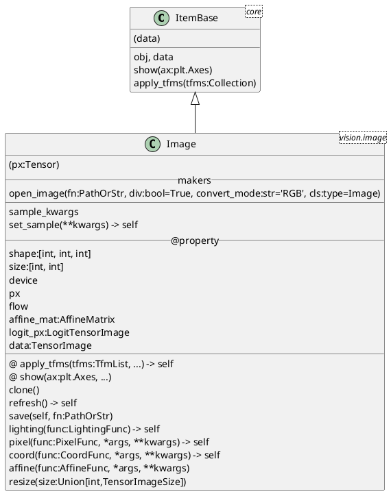

```puml
@startuml
class ItemBase <core> {
    (data)
    __
    obj, data
    show(ax:plt.Axes)
    apply_tfms(tfms:Collection)
}
class Image <vision.image> {
    (px:Tensor)
    __makers__
    open_image(fn:PathOrStr, div:bool=True, convert_mode:str='RGB', cls:type=Image)
    __
    sample_kwargs
    set_sample(**kwargs) -> self
    __@property__
    shape:[int, int, int]
    size:[int, int]
    device
    px
    flow
    affine_mat:AffineMatrix
    logit_px:LogitTensorImage
    data:TensorImage
    __
    @ apply_tfms(tfms:TfmList, ...) -> self
    @ show(ax:plt.Axes, ...) 
    clone()
    refresh() -> self
    save(self, fn:PathOrStr)
    lighting(func:LightingFunc) -> self
    pixel(func:PixelFunc, *args, **kwargs) -> self
    coord(func:CoordFunc, *args, **kwargs) -> self
    affine(func:AffineFunc, *args, **kwargs)
    resize(size:Union[int,TensorImageSize])
}
class Image
ItemBase <|-- Image

@enduml
```
