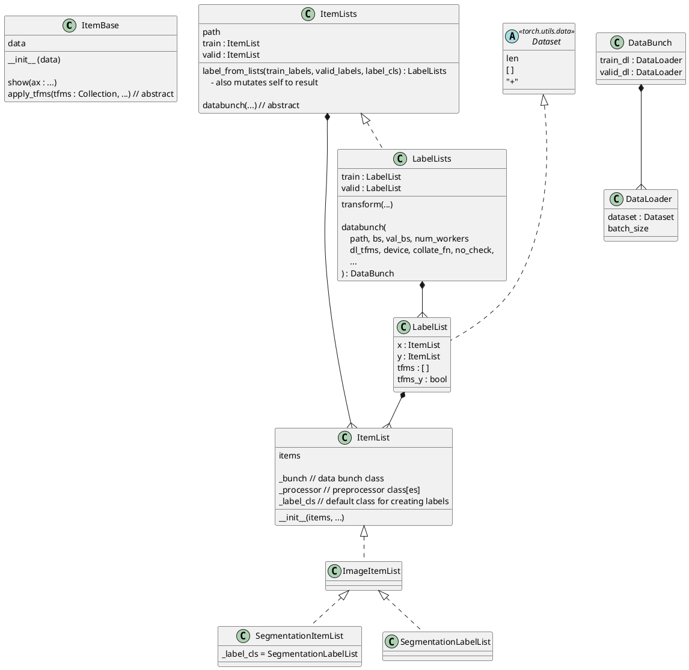

# Fastai 1.0 Data Block API

```puml
@startuml
class ItemBase {
    data

    __init__ (data)

    show(ax : ...)
    apply_tfms(tfms : Collection, ...) // abstract
}

class ItemList {
    items

    _bunch // data bunch class
    _processor // preprocessor class[es]
    _label_cls // default class for creating labels

    __init__(items, ...)
}
class SegmentationItemList {
    _label_cls = SegmentationLabelList
}
ItemList <|.. ImageItemList
ImageItemList <|.. SegmentationItemList
ImageItemList <|.. SegmentationLabelList

class ItemLists {
    path
    train : ItemList
    valid : ItemList

    label_from_lists(train_labels, valid_labels, label_cls) : LabelLists\
    \n    - also mutates self to result

    databunch(...) // abstract
}
class LabelLists {
    train : LabelList
    valid : LabelList

    transform(...)

    databunch(\
    \n    path, bs, val_bs, num_workers\
    \n    dl_tfms, device, collate_fn, no_check,\
    \n    ...\
    \n) : DataBunch
}
ItemLists *--{ ItemList
ItemLists <|.. LabelLists
LabelLists *--{ LabelList

abstract Dataset <<torch.utils.data>> {
    len
    [ ]
    "+"
}
class LabelList {
    x : ItemList
    y : ItemList
    tfms : [ ]
    tfms_y : bool
}
Dataset <|... LabelList
LabelList *--{ ItemList

class DataBunch {
    train_dl : DataLoader
    valid_dl : DataLoader
}
class DataLoader {
    dataset : Dataset
    batch_size
}
DataBunch *--{ DataLoader

@enduml
```
